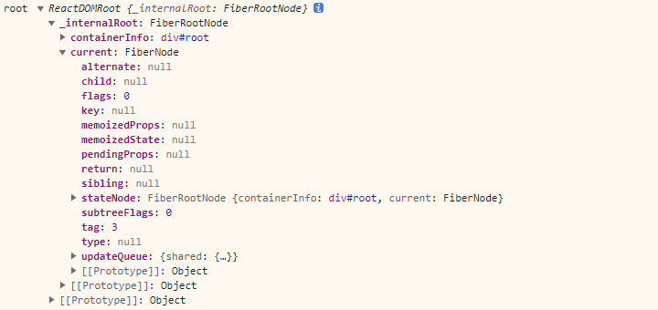
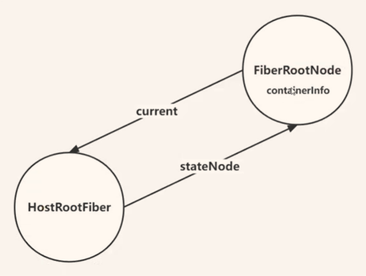
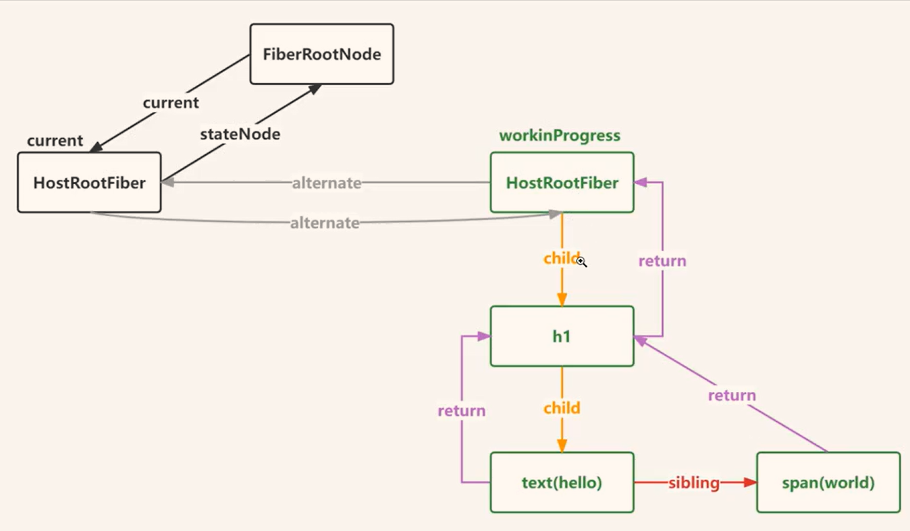

# 创建 FiberRoot

我们在创建的是 FiberRootNode

## 1.5  fiber

> 为什么会有 fiber?

1. JS任务执行时间过长
   - 浏览器默认刷新率为60Hz，大概每 16.6ms 渲染一次，js线程和渲染线程互斥。会导致掉帧
2. 屏幕刷新率
   - 60次/s
   - 1s 60 帧 = 16ms，书写代码力求不让一帧工作时长超过 16ms

## 1.6 fiber 树

虚拟dom会在内存中创建 fiber 树，是一个链表（互相链接的结构）
---

span 并没有一个叫 `text(world)` 的儿子，这是 react 的一个优化。
父亲是不知道二儿子的，只能通过第一个儿子，找第二个儿子。
